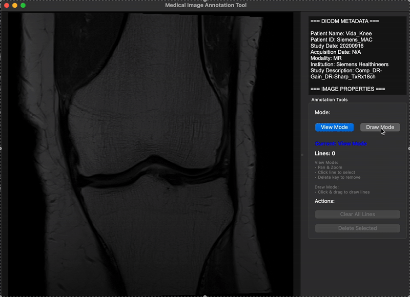

# Medical Image Annotation Tool
**DICOM Medical Image Viewer and Annotation System using C++, Qt, and GDCM**

---

## Table of Contents
1. [Project Overview](#project-overview)
2. [Features](#features)
3. [Technologies & Skills Used](#technologies--skills-used)
4. [Installation & Setup](#installation--setup)
5. [Usage](#usage)
6. [DICOM Support](#dicom-support)
7. [Annotation System](#annotation-system)
8. [Next Steps](#next-steps)
9. [Project Structure](#project-structure)

---

## Project Overview
Medical Image Annotation Tool is a professional desktop application built using C++ and Qt framework for orthopedic physicians to load, view, and annotate DICOM medical images. The application enables precise line drawing for measurement and analysis of anatomical structures on X-rays, MRIs, CT scans, and standard medical imaging formats.



---

## Features
* Load and display DICOM medical images (.dcm, .dicom files) with metadata extraction.
* Support for 8-bit, 12-bit, and 16-bit medical image formats.
* Professional split screen interface with image viewer and metadata panel.
* Dual-mode operation: View Mode (pan/zoom) and Draw Mode (annotation).
* Precision line drawing with click and drag interaction.
* Line selection, deletion, and management system.
* Real time visual feedback during annotation creation.
* DICOM metadata display (patient info, study details, technical specifications).

---

## Technologies & Skills Used
* **Programming**: C++17, Object Oriented Programming (OOP), modular architecture design.
* **GUI**: Qt 6 Framework, Qt Widgets (`QMainWindow`, `QGraphicsView`, `QSplitter`, `QGroupBox`).
* **Medical Imaging**: GDCM (Grassroots DICOM) library integration, DICOM format processing.
* **Graphics**: Qt Graphics Framework (`QGraphicsScene`, `QGraphicsLineItem`, custom mouse event handling).
* **Build System**: CMake with automatic MOC processing and external library linking.
* **Development Tools**: Qt Creator, cross platform development.

---

## Installation & Setup
1. Install dependencies:
   ```bash
   # macOS
   brew install qt6 gdcm cmake
   ```
2. Clone the repository:
   ```bash
   git clone [repository-url]
   cd medical-image-annotation-tool
   ```
3. Build with CMake:
   ```bash
   mkdir build && cd build
   cmake ..
   make
   ```
4. Run the application:
   ```bash
   ./MedicalImageViewer
   ```

---

## Usage
1. **Load Images**: File → Open Image to select DICOM (.dcm) or standard image files.
2. **View Metadata**: Patient information and technical details display automatically in right panel.
3. **Navigate Images**: Use View Mode for pan (click drag) and zoom (mouse wheel) operations.
4. **Create Annotations**: Switch to Draw Mode and click drag to create measurement lines.
5. **Manage Lines**: Click lines in View Mode to select (yellow highlight), use Delete key or button to remove.
6. **Clear Annotations**: Use "Clear All Lines" to remove all annotations from current image.

---

## DICOM Support
* **File Formats**: .dcm, .dicom medical imaging files plus PNG, JPEG, BMP standards.
* **Bit Depths**: 8-bit (standard), 12-bit (X-ray), 16-bit (CT/MRI) with automatic scaling.
* **Metadata Extraction**: Patient Name/ID, Study Date, Modality, Institution, Image Properties.
* **Multi-frame Handling**: Displays first frame of multi-slice/3D DICOM files.

| DICOM Tag | Description | Example |
|-----------|-------------|---------|
| (0010,0010) | Patient Name | Smith^John^^^ |
| (0008,0060) | Modality | CR, CT, MR, XA |
| (0008,0020) | Study Date | 20240327 |
| (0028,0010) | Image Width | 2048 |

---

## Annotation System
* **Drawing Tools**: Precision straight-line annotations for medical measurements.
* **Visual Feedback**: Blue dashed preview during drawing, red permanent lines.
* **Selection System**: Yellow highlight for selected lines, click-to-select interface.
* **Management**: Individual line deletion, clear all functionality, line count tracking.
* **Medical Applications**: Joint angle measurement, bone alignment analysis, fracture assessment.

---

## Next Steps
* Currently measurements and angles creation.
* Support for 3D image viewing.
* Measurement for those 3D images.

## Project Structure
```
MedicalImageViewer/
├── main.cpp                     # Application entry point
├── mainwindow.h/cpp             # Main UI coordination and file management
├── imageviewer.h/cpp            # Custom graphics view with pan/zoom/drawing
├── dicomloader.h/cpp            # DICOM file processing and metadata extraction
├── annotationmanager.h/cpp      # Line drawing and annotation management
├── CMakeLists.txt               # CMake build configuration with GDCM integration
└── README.md
```
